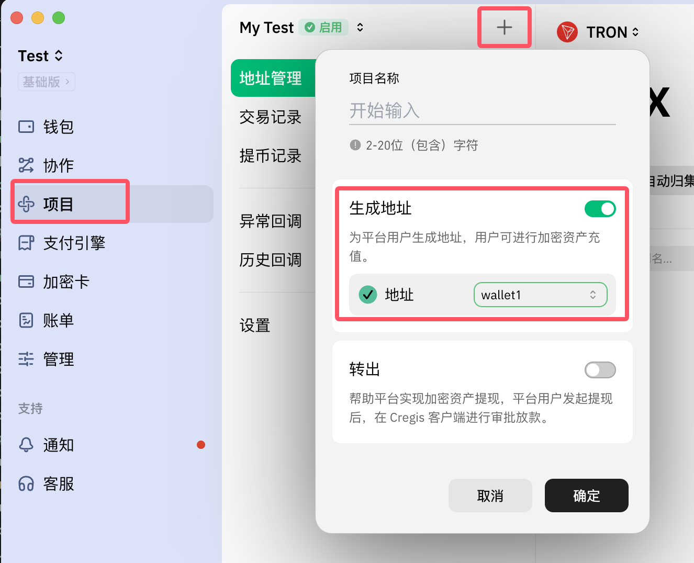
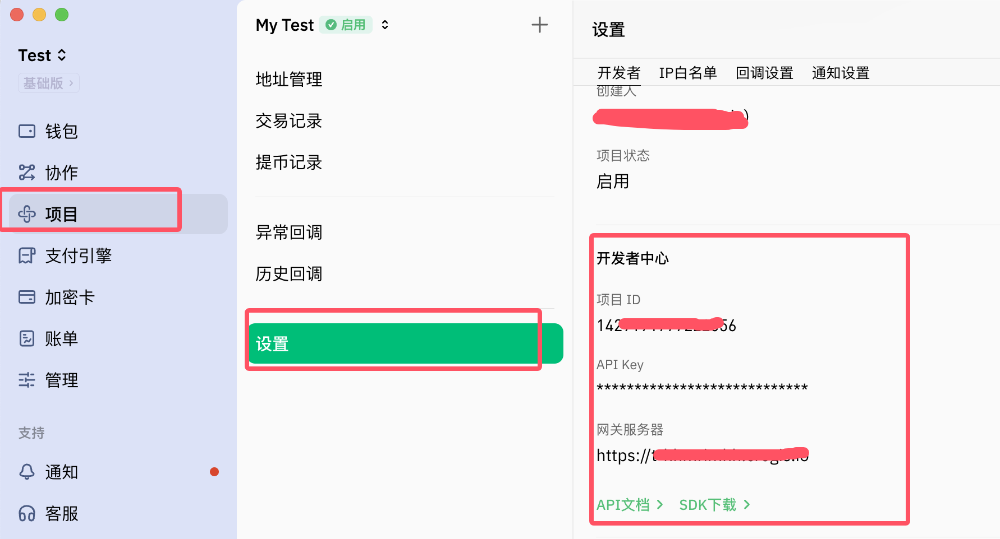
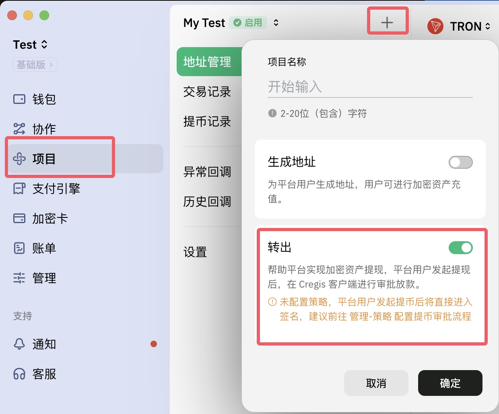

## 场景说明

项目API支持创建地址进行充值和提币付款两种类型业务，常用于交易所等类型平台用户的出入金管理  

### _地址充值_

> 每次调用成功将生成新的地址，可在用户注册成功时调用，将生成的地址设置为用户的固定充值地址，当接收到该地址的链上充值通知时，给该用户进行充值。
> 注意：EVM类型地址可以公用同一个地址，例如：USDT-BEP20、USDT-ERC20可以都使用ETH地址进行充值

1、创建钱包  
2、创建项目，选择‘生成地址’

    

3、获取API key等信息

    

### _提币_

> 平台用户出金提现时调用该API，最终在CREGIS钱包中签名后交易将上链，可根据交易上链后的实际结果通知来进行扣除用户在平台中的资金

1、策略设置（可选），<a href='https://support.cregis.com/cregis-wallet-guide/zh-cn/risk_management/policy_engine' target="_blank">了解策略</a>  
2、创建项目，选择‘转出’

    

3、获取API key等信息

    

