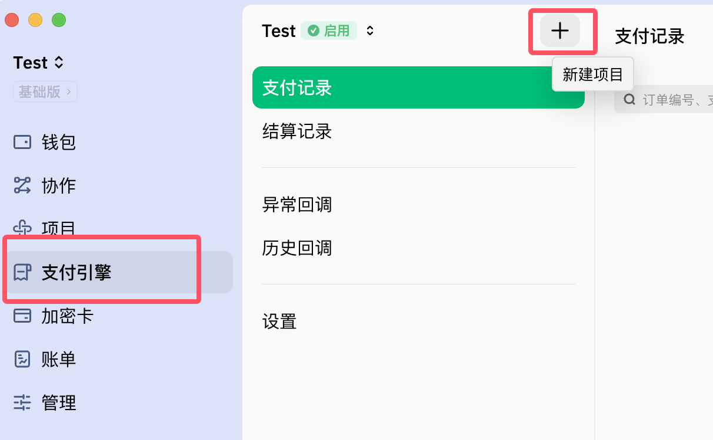
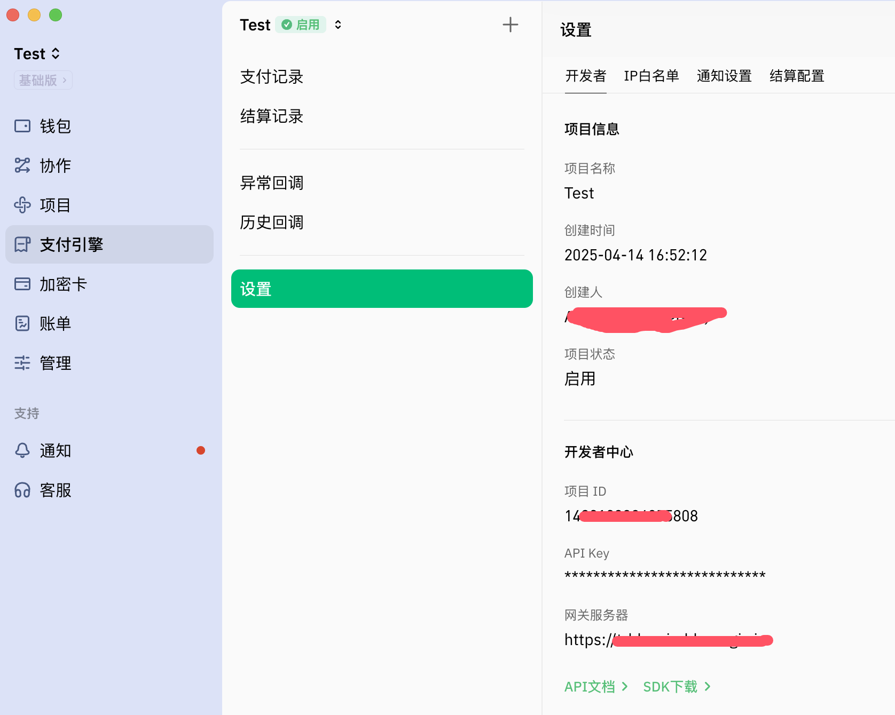

## 场景说明

支付引擎API提供加密支付解决方案，商户只需通过该API接口即可快速实现收款业务，无需自行维护收款地址、地址资金归集等操作。该接口调用成功后可使用CREGIS已提供好的收银台直接使用，也可根据需求自行设计收单流程界面。<a href='https://support.cregis.com/cregis-wallet-guide/zh-cn/payment_engine/introduction' target='_blank'>去了解详情</a>

## 对接流程
1、创建钱包，以供设置结算收款地址  
2、 在‘支付引擎’中创建项目

    

3、获取API key等信息

    

